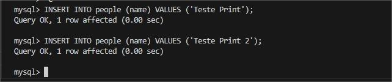

Projeto prático docker: Utilizando Nginx com Node.js e MySQL

Sobre o desafio:
Nesse desafio você colocará em prática o que aprendemos em relação a utilização do nginx como proxy reverso. A idéia principal é que quando um usuário acesse o nginx, o mesmo fará uma chamada em nossa aplicação node.js. Essa aplicação por sua vez adicionará um registro em nosso banco de dados mysql, cadastrando um nome na tabela people.

O retorno da aplicação node.js para o nginx deverá ser:

<h1>Full Cycle Rocks!</h1>

- Lista de nomes cadastrada no banco de dados.

Gere o docker-compose de uma forma que basta apenas rodarmos: docker-compose up -d que tudo deverá estar funcionando e disponível na porta: 8080.

Não esqueça de colocar o volume na aplicação para o ambiente de desenvolvimento.

Suba tudo em um repositório e faça a entrega.

- A linguagem de programação para este desafio é Node/JavaScript.

#

#

#

## Estrutura do Projeto

- `node-app`: Aplicação Node.js que insere e lista nomes em um banco de dados MySQL.
- `nginx`: Configuração do Nginx como proxy reverso.
- `docker-compose.yml`: Arquivo de configuração do Docker Compose para orquestrar os serviços.

Etapas:

1.Clone este repositório

2.Execute o Docker Compose
docker-compose up -d

3.Acesse a aplicação em [http://localhost:8080](http://localhost:8080).

\*\*Por default a construção do container já vai inserir caso nao tenha 2 nomes para mostrar no site.

- Caso queira inserir mais nomes utilizar a tabela people

## Tecnologias Utilizadas

- Node.js
- MySQL
- Nginx
- Docker
- Docker Compose

